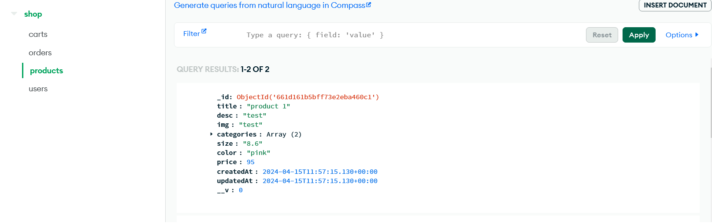

Dans mon tout premier projet backend, j'ai exploré les bases du développement côté serveur pour créer une API afin d'avoir la base pour mo projet de création d'un site d'e-commerce
Cela m'a permit d'apprendre plein de nouveaux outils :

- Node.js et Express : J'ai découvert Node.js et Express pour créer une API simple mais robuste, posant ainsi les fondations de mon projet.
- MongoDB : En intégrant MongoDB, j'ai appris à stocker et manipuler les données de manière efficace, en vue de mon projet futur.
- Sécurité avec JWT et CryptoJS : J'ai expérimenté l'authentification sécurisée avec JWT et le chiffrement des mots de passe pour garantir la protection des données.
- Tests avec Postman : J'ai utilisé Postman pour tester et valider les fonctionnalités de mon API, assurant sa fiabilité dès le début du processus.
- Paiements avec Stripe : L'intégration de l'API Stripe m'a permis d'explorer les bases des transactions en ligne, ouvrant ainsi la voie à des fonctionnalités de paiement dans mon futur site e-commerce.

